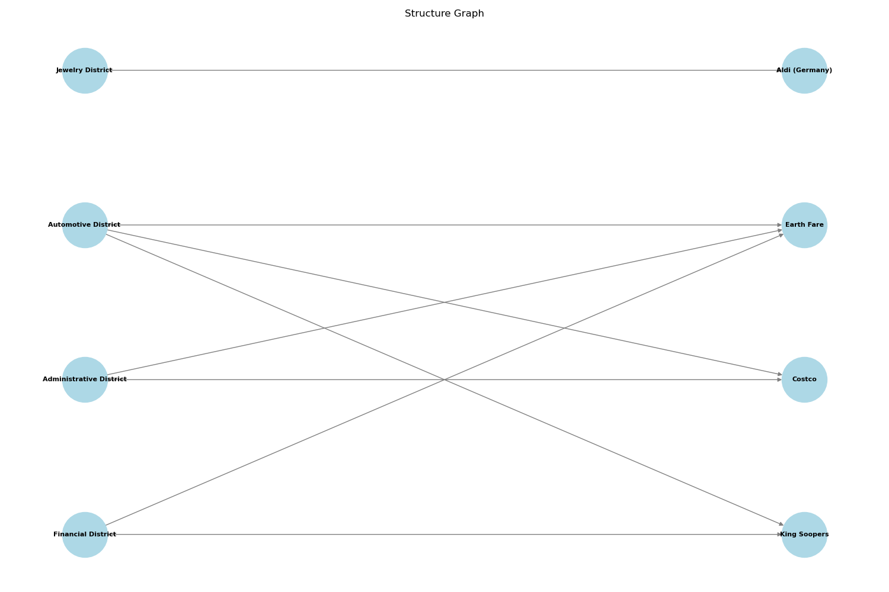

# Replication of iGSM dataset generation

This dataset eliminates the risk of data contamination and provides a more accurate assessment of the LLM’s reasoning ability.

### TODO: More detailed background information for evaluation

Example:

Background: There are 3 types of Classrooms: Music Room, Film Studio and Dance Studio. There are 3 types of Backpacks: School Daypack, Messenger Backpack and Canvas Backpack. There are 3 types of Stationerys: Calculator, Scissors and Ruler. Each Music Room can have Messenger Backpack. Each Film Studio can have School Daypack, Messenger Backpack and Canvas Backpack. Each Dance Studio can have School Daypack, Messenger Backpack and Canvas Backpack. Each School Daypack can have Scissors. Each Messenger Backpack can have Calculator and Scissors. Each Canvas Backpack can have Calculator and Ruler.

## Sample Question (mod 23 arithmetic)

<p align="center">
  
</p>

### Question description:

District category contains Financial District, Automotive District, Jewelry District, and Administrative District.
Supermarkets category contains King Soopers, Costco, Earth Fare, and Aldi (Germany).
The number of each Financial District 's Earth Fare equals the sum of each Automotive District 's King Soopers and each Administrative District 's Earth Fare.
The number of each Administrative District 's Earth Fare equals 14.
The number of each Automotive District 's Costco equals 14 times the sum of each Jewelry District 's Supermarkets and each Jewelry District 's Aldi (Germany).
The number of each Automotive District 's Earth Fare equals 22.
The number of each Jewelry District 's Aldi (Germany) equals 1 times each Financial District 's Earth Fare.
The number of each Automotive District 's King Soopers equals 19 more than each Administrative District 's Earth Fare.
The number of each Financial District 's King Soopers equals each Administrative District 's Supermarkets.
The number of each Administrative District 's Costco equals 4.
How many Costco does Automotive District have?

### Solution:

Define each Administrative District 's Earth Fare as D; So D = 14.
Define each Automotive District 's King Soopers as N; So N = 19 + D = 19 + 14 = 10.
Define each Financial District 's Earth Fare as q; So q = N + D = 10 + 14 = 1.
Define each Jewelry District 's Aldi (Germany) as i; So i = 1 * q = 1 * 1 = 1.
Define each Jewelry District 's Supermarkets as u; So u = i = 1.
Define each Automotive District 's Costco as C; V = u + i = 1 + 1 = 2; So C = 14 * V = 14 * 2 = 5.

### LLM system prompt

You're an expert at solving elementary math problems involving addition, subtraction, and multiplication. You solve all the problems in a uniform format. All calculations are done modulo 23. For example, 22 + 3 equals 2, 11 + 21 equals 9, 14 + 22 + 4 equals 17, 3 * 12 equals 13, and 3 * 11 equals 10. When providing your solution, please end with 'The final answer is <<x>>.' where x is your final answer, an integer between 0 and 22. You must solve all the problems using the same solution format.

Our scenarios involve up to four categories of objects: District, Supermarkets, Product and Ingredient. Each District may contain Supermarkets, each Supermarkets may contain Product, and each Product may contain Ingredient. We can specify quantities, such as "The number of each Makro 's Cheesecake." Assume that every entity with the same name has an identical configuration; for example, each Makro contains the same number of Cheesecake. Another guiding principle is that what is not mentioned does not exist: when we refer to Product at Makro, we are only discussing the Product explicitly mentioned in our scenario. Furthermore, if Makro is not even mentioned, any Product within it is automatically considered to be non-existent (i.e. 0).


## run the generation

```python
python3 main.py
```

- original paper: Physics of Language Models: Part 2.1,
Grade-School Math and the Hidden Reasoning Process https://arxiv.org/abs/2407.20311

- original project url: https://physics.allen-zhu.com/part-2-grade-school-math/part-2-1


- functions are in folder: utils

- question/solution pairs are in folder: dataset

- evalution: not yet finished; system prompt is necessary
