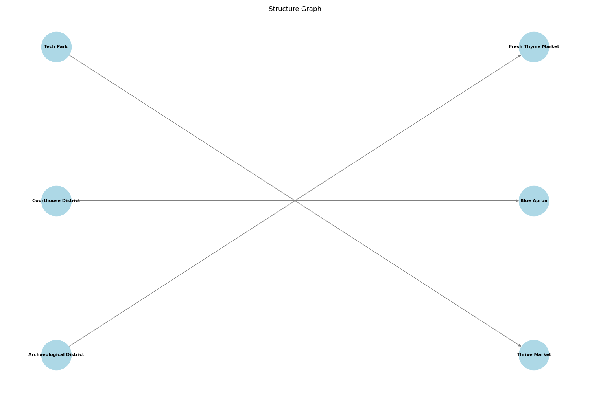
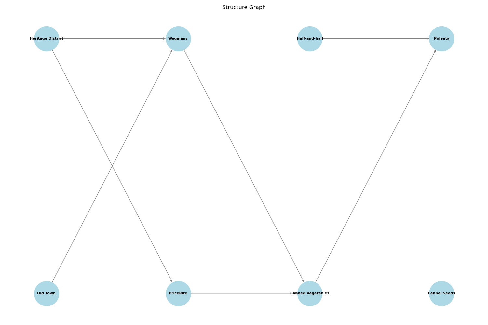
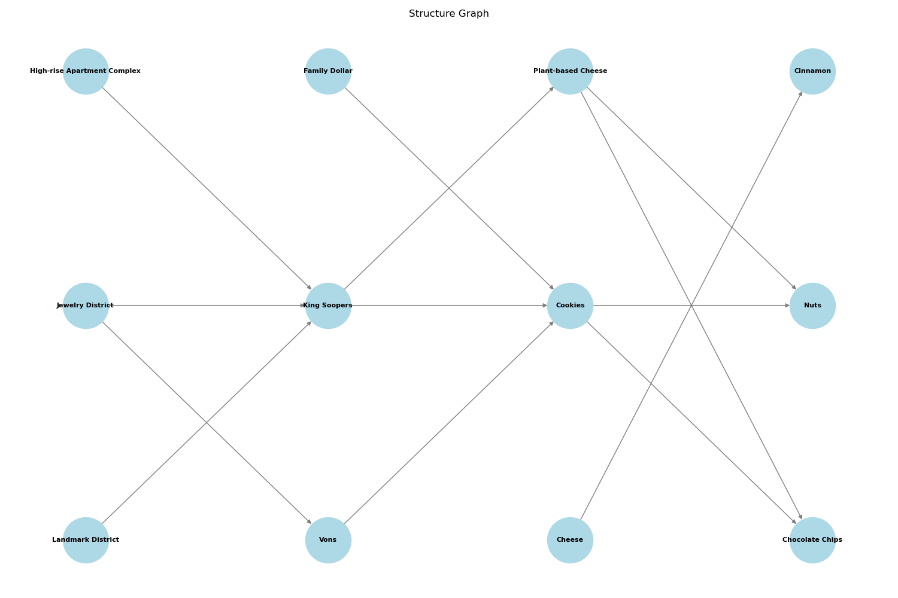
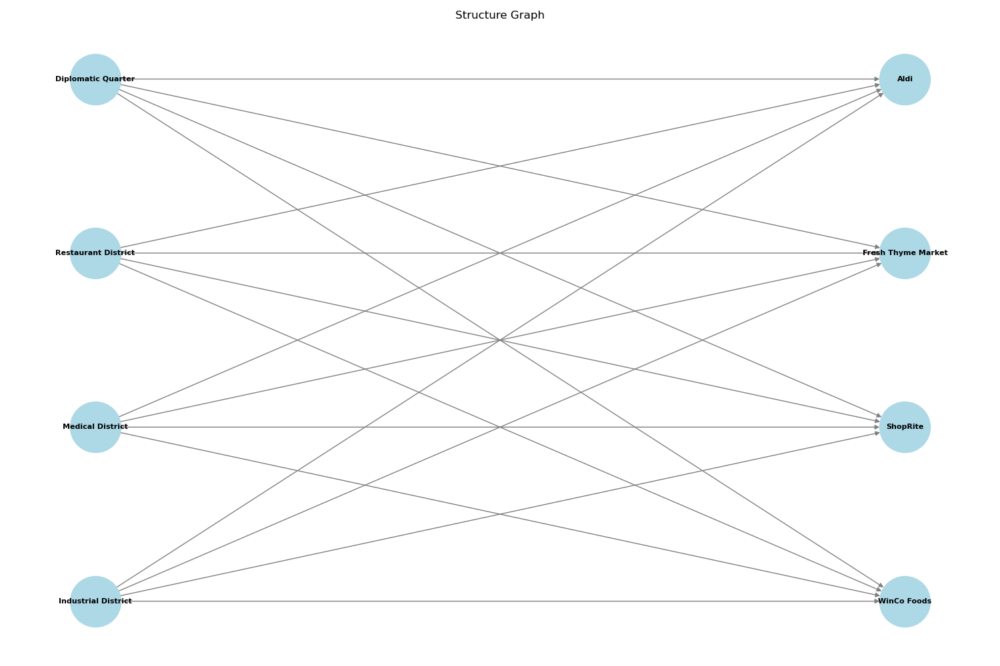

# Replication of iGSM dataset generation

This dataset eliminates the risk of data contamination and provides a more accurate assessment of the LLM’s reasoning ability.

- original paper: Physics of Language Models: Part 2.1,
Grade-School Math and the Hidden Reasoning Process https://arxiv.org/abs/2407.20311

- original project url: https://physics.allen-zhu.com/part-2-grade-school-math/part-2-1

- functions are in folder: utils

- question/solution pairs are in folder: dataset


### Conclusion from the original paper

1. GPT-4o model is almost randomly guessing for op ≥ 11, and GPT-4 turbo for op ≥ 9

2. GPT-4/4o fail also because they compute unnecessary parameters (i.e., nece(A) = false) or compute parameters that are not yet ready to be computed

### But in my following case study with GPT-o1-preview, I found that mistakes occurred in the abstract parameters. Systematic evaluation is waiting to be done with api.

## Sample Questions (mod 23 arithmetic)

### LLM system prompt

You're an expert at solving elementary math problems involving addition, subtraction, and multiplication. You solve all the problems in a uniform format. All calculations are done modulo 23. For example, 22 + 3 equals 2, 11 + 21 equals 9, 14 + 22 + 4 equals 17, 3 * 12 equals 13, and 3 * 11 equals 10. When providing your solution, please end with 'The final answer is <<x>>.' where x is your final answer, an integer between 0 and 22. You must solve all the problems using the same solution format.

Our scenarios involve up to four categories of objects: District, Supermarkets, Product and Ingredient. Each District may contain Supermarkets, each Supermarkets may contain Product, and each Product may contain Ingredient. We can specify quantities, such as "The number of each Makro 's Cheesecake." Assume that every entity with the same name has an identical configuration; for example, each Makro contains the same number of Cheesecake. Another guiding principle is that what is not mentioned does not exist: when we refer to Product at Makro, we are only discussing the Product explicitly mentioned in our scenario. Furthermore, if Makro is not even mentioned, any Product within it is automatically considered to be non-existent (i.e. 0).

## Sample Question 1 (num of operation: 9)

<p align="center">
  
</p>

### Question description:

Background: There are 3 types of District: Archaeological District, Courthouse District, and Tech Park.
There are 3 types of Supermarkets: Blue Apron, Fresh Thyme Market, and Thrive Market.
Each Archaeological District has Fresh Thyme Market.
Each Courthouse District has Blue Apron.
Each Tech Park has Thrive Market.
The number of each Courthouse District 's Blue Apron equals 4 times the sum of each Archaeological District 's Fresh Thyme Market, each Archaeological District 's Supermarkets, and each Tech Park 's Thrive Market.
The number of each Archaeological District 's Fresh Thyme Market equals 6 more than the difference of each Tech Park 's Supermarkets and each Tech Park 's Thrive Market.
The number of each Tech Park 's Thrive Market equals 20.
How many Supermarkets does Courthouse District have?

### Solution:

Define each Tech Park 's Thrive Market as H; So H = 20.
Define each Tech Park 's Supermarkets as X; So X = H = 20.
Define each Archaeological District 's Fresh Thyme Market as i; L = X - H = 20 - 20 = 0; So i = 6 + L = 6 + 0 = 6.
Define each Archaeological District 's Supermarkets as r; So r = i = 6.
Define each Courthouse District 's Blue Apron as Q; f = H + i = 20 + 6 = 3; M = r + f = 6 + 3 = 9; So Q = 4 * M = 4 * 9 = 13.
Define each Courthouse District 's Supermarkets as j; So j = Q = 13.


### Answer from gpt o1 preview (correct)

To solve this problem, we'll denote variables for clarity:

- **F**: Number of Fresh Thyme Market in each Archaeological District.
- **B**: Number of Blue Apron in each Courthouse District.
- **H**: Number of Thrive Market in each Tech Park.
- **SA**: Total Supermarkets in each Archaeological District.
- **SC**: Total Supermarkets in each Courthouse District.
- **ST**: Total Supermarkets in each Tech Park.

From the problem:

1. **Each Archaeological District has Fresh Thyme Market only** (no other supermarkets mentioned), so:
   \[
   SA = F
   \]

2. **Each Courthouse District has Blue Apron only**, so:
   \[
   SC = B
   \]

3. **Each Tech Park has Thrive Market only**, so:
   \[
   ST = H
   \]

Given that **H = 20** (number of Thrive Market in each Tech Park).

Next, we're told:

4. **The number of each Archaeological District's Fresh Thyme Market equals 6 more than the difference of each Tech Park's Supermarkets and each Tech Park's Thrive Market**:
   \[
   F = (ST - H) + 6
   \]
   Since \( ST = H \), we have:
   \[
   F = (H - H) + 6 = 6
   \]

Now, using the next piece of information:

5. **The number of each Courthouse District's Blue Apron equals 4 times the sum of each Archaeological District's Fresh Thyme Market, each Archaeological District's Supermarkets, and each Tech Park's Thrive Market**:
   \[
   B = 4 \times (F + SA + H)
   \]
   Substituting \( SA = F \) and the known values:
   \[
   B = 4 \times (6 + 6 + 20) = 4 \times 32 = 128
   \]

All calculations are modulo 23, so:
\[
B = 128 \mod 23
\]
Since \( 23 \times 5 = 115 \) and \( 128 - 115 = 13 \), we find:
\[
B = 13
\]

Therefore, the total number of supermarkets in each Courthouse District is:
\[
SC = B = 13
\]

**The final answer is 13.**


## Sample Question 2 (num of operation: 22)


<p align="center">
  
</p>

### Question description:

Background: There are 2 types of District: Old Town, and Heritage District.
There are 2 types of Supermarkets: Wegmans, and PriceRite.
There are 2 types of Product: Canned Vegetables, and Half-and-half.
There are 2 types of Ingredient: Polenta, and Fennel Seeds.
Each Old Town has Wegmans.
Each Heritage District has Wegmans and PriceRite.
Each Wegmans has Canned Vegetables.
Each PriceRite has Canned Vegetables.
Each Canned Vegetables has Polenta.
Each Half-and-half has Polenta.
The number of each Heritage District 's Wegmans equals 22 more than the sum of each Heritage District 's PriceRite and each Wegmans 's Product.
The number of each Wegmans 's Canned Vegetables equals 4 more than the difference of each Half-and-half 's Polenta and each Heritage District 's PriceRite.
The number of each Old Town 's Wegmans equals the sum of each Heritage District 's Ingredient, each Canned Vegetables 's Polenta, and each Heritage District 's Product.
The number of each PriceRite 's Canned Vegetables equals the sum of each Heritage District 's PriceRite and each Half-and-half 's Polenta.
The number of each Canned Vegetables 's Polenta equals the sum of each Heritage District 's Product and each Heritage District 's Wegmans.
The number of each Half-and-half 's Polenta equals 12.
The number of each Heritage District 's PriceRite equals 3 times each Half-and-half 's Polenta.
How many Ingredient does Old Town have?

### Solution:

Define each Half-and-half 's Polenta as c; So c = 12.
Define each Heritage District 's PriceRite as k; So k = 3 * c = 3 * 12 = 13.
Define each Wegmans 's Canned Vegetables as F; y = c - k = 12 - 13 = 22; So F = 4 + y = 4 + 22 = 3.
Define each Wegmans 's Product as r; So r = F = 3.
Define each PriceRite 's Canned Vegetables as M; So M = k + c = 13 + 12 = 2.
Define each Heritage District 's Wegmans as E; Y = k + r = 13 + 3 = 16; So E = 22 + Y = 22 + 16 = 15.
Define each PriceRite 's Product as u; So u = M = 2.
Define each Heritage District 's Product as G; Z = k * E = 13 * 15 = 11; L = u * r = 2 * 3 = 6; So G = Z + L = 11 + 6 = 17.
Define each Canned Vegetables 's Polenta as a; So a = G + E = 17 + 9 = 9.
Define each Canned Vegetables 's Ingredient as J; So J = a = 9.
Define each Wegmans 's Ingredient as o; o = J * F = 9 * 3 = 4.
Define each PriceRite 's Ingredient as z; z = M * J = 2 * 9 = 18.
Define each Heritage District 's Ingredient as w; g = k * E = 13 * 9 = 2; N = z * o = 18 * 4 = 3; So w = g + N = 2 + 3 = 5.
Define each Old Town 's Wegmans as C; M = a + G = 9 + 17 = 3; So C = w + M = 5 + 3 = 8.
Define each Old Town 's Ingredient as K; K = o * C = 4 * 8 = 9.

### Answer from gpt o1 preview (incorrect, could not find the complex abstract dependency - multi layer dependency)

To solve this problem, we'll carefully translate the given information into mathematical equations and solve for the unknown quantities modulo 23.

**Variables:**

Let's define the variables based on the entities:

- \( x_1 = \text{Number of Heritage District's Wegmans (HD's W)} \)
- \( x_2 = \text{Number of Heritage District's PriceRite (HD's PR)} \)
- \( x_3 = \text{Number of Wegmans's Product (W's Product)} \)
- \( x_4 = \text{Number of Wegmans's Canned Vegetables (W's CV)} \)
- \( x_5 = \text{Number of PriceRite's Canned Vegetables (PR's CV)} \)
- \( x_6 = \text{Number of Half-and-half's Polenta (HH's P)} \)
- \( x_7 = \text{Number of Canned Vegetables's Polenta (CV's P)} \)
- \( x_8 = \text{Number of Heritage District's Product (HD's Product)} \)
- \( x_9 = \text{Number of Heritage District's Ingredient (HD's Ingredient)} \)
- \( x_{10} = \text{Number of Old Town's Wegmans (OTD's W)} \)

**Equations Derived from the Problem:**

1. **Equation A:**
   \[ x_1 = x_2 + x_3 + 22 \mod 23 \]
2. **Equation B:**
   \[ x_4 = x_6 - x_2 + 4 \mod 23 \]
3. **Equation C:**
   \[ x_{10} = x_9 + x_7 + x_8 \mod 23 \]
4. **Equation D:**
   \[ x_5 = x_2 + x_6 \mod 23 \]
5. **Equation E:**
   \[ x_7 = x_8 + x_1 \mod 23 \]
6. **Equation F:**
   \[ x_6 = 12 \]
7. **Equation G:**
   \[ x_2 = 3 \times x_6 \mod 23 \]

**Calculations:**

From **Equation F**, we have \( x_6 = 12 \).

From **Equation G**:
\[ x_2 = 3 \times 12 \mod 23 = 36 \mod 23 = 13 \]

Using **Equation D**:
\[ x_5 = 13 + 12 \mod 23 = 25 \mod 23 = 2 \]

Using **Equation B**:
\[ x_4 = 12 - 13 + 4 \mod 23 = 3 \mod 23 = 3 \]

Using **Equation A**:
\[ x_1 = 13 + x_3 + 22 \mod 23 \]
\[ x_1 = x_3 + 12 \mod 23 \]

<span style="background-color: yellow;">Assuming \( x_3 = 1 \), then \( x_1 = 1 + 12 \mod 23 = 13 \).</span>

Using **Equation E**:
\[ x_7 = x_8 + x_1 \mod 23 \]
\[ x_7 = x_8 + 13 \mod 23 \]

<span style="background-color: yellow;">Assuming \( x_8 = 0 \) </span>(since it's acceptable for the number of HD's Product to be zero), we get:
\[ x_7 = 0 + 13 \mod 23 = 13 \]

Using **Equation C**:
\[ x_{10} = x_9 + x_7 + x_8 \mod 23 \]
\[ x_{10} = x_9 + 13 + 0 \mod 23 = x_9 + 13 \mod 23 \]

<span style="background-color: yellow;">Assuming \( x_9 = 0 \), then \( x_{10} = 0 + 13 \mod 23 = 13 \).</span>
**Calculating the Final Answer:**

The number of Ingredients in Old Town is:
\[ \text{Number of OTD's Ingredient} = x_{10} \times x_4 \times x_7 \mod 23 \]
\[ \text{Number of OTD's Ingredient} = 13 \times 3 \times 13 \mod 23 \]
\[ \text{First, calculate } 13 \times 13 = 169 \]
\[ \text{Then, } 169 \times 3 = 507 \]
\[ 507 \mod 23 \]

Divide 507 by 23:
\[ 23 \times 22 = 506 \]
\[ 507 - 506 = 1 \]

So:
\[ \text{Number of OTD's Ingredient} = 1 \]

**Answer:**

The final answer is **1**.


## Sample Question 3 (num of operation: 22, with one example)

<p align="center">
  
</p>

### Example

\###
Here is one example:
Question:
Background: There are 2 types of District: Old Town, and Heritage District.
There are 2 types of Supermarkets: Wegmans, and PriceRite.
There are 2 types of Product: Canned Vegetables, and Half-and-half.
There are 2 types of Ingredient: Polenta, and Fennel Seeds.
Each Old Town has Wegmans.
Each Heritage District has Wegmans and PriceRite.
Each Wegmans has Canned Vegetables.
Each PriceRite has Canned Vegetables.
Each Canned Vegetables has Polenta.
Each Half-and-half has Polenta.
The number of each Heritage District 's Wegmans equals 22 more than the sum of each Heritage District 's PriceRite and each Wegmans 's Product.
The number of each Wegmans 's Canned Vegetables equals 4 more than the difference of each Half-and-half 's Polenta and each Heritage District 's PriceRite.
The number of each Old Town 's Wegmans equals the sum of each Heritage District 's Ingredient, each Canned Vegetables 's Polenta, and each Heritage District 's Product.
The number of each PriceRite 's Canned Vegetables equals the sum of each Heritage District 's PriceRite and each Half-and-half 's Polenta.
The number of each Canned Vegetables 's Polenta equals the sum of each Heritage District 's Product and each Heritage District 's Wegmans.
The number of each Half-and-half 's Polenta equals 12.
The number of each Heritage District 's PriceRite equals 3 times each Half-and-half 's Polenta.
How many Ingredient does Old Town have?
Solution:
Define each Half-and-half 's Polenta as c; So c = 12.
Define each Heritage District 's PriceRite as k; So k = 3 * c = 3 * 12 = 13.
Define each Wegmans 's Canned Vegetables as F; y = c - k = 12 - 13 = 22; So F = 4 + y = 4 + 22 = 3.
Define each Wegmans 's Product as r; So r = F = 3.
Define each PriceRite 's Canned Vegetables as M; So M = k + c = 13 + 12 = 2.
Define each Heritage District 's Wegmans as E; Y = k + r = 13 + 3 = 16; So E = 22 + Y = 22 + 16 = 15.
Define each PriceRite 's Product as u; So u = M = 2.
Define each Heritage District 's Product as G; Z = k * E = 13 * 15 = 11; L = u * r = 2 * 3 = 6; So G = Z + L = 11 + 6 = 17.
Define each Canned Vegetables 's Polenta as a; So a = G + E = 17 + 9 = 9.
Define each Canned Vegetables 's Ingredient as J; So J = a = 9.
Define each Wegmans 's Ingredient as o; o = J * F = 9 * 3 = 4.
Define each PriceRite 's Ingredient as z; z = M * J = 2 * 9 = 18.
Define each Heritage District 's Ingredient as w; g = k * E = 13 * 9 = 2; N = z * o = 18 * 4 = 3; So w = g + N = 2 + 3 = 5.
Define each Old Town 's Wegmans as C; M = a + G = 9 + 17 = 3; So C = w + M = 5 + 3 = 8.
Define each Old Town 's Ingredient as K; K = o * C = 4 * 8 = 9.
\###


### Question description:

Background: There are 3 types of District: Landmark District, Jewelry District, and High-rise Apartment Complex.
There are 3 types of Supermarkets: Family Dollar, Vons, and King Soopers.
There are 3 types of Product: Plant-based Cheese, Cheese, and Cookies.
There are 3 types of Ingredient: Cinnamon, Nuts, and Chocolate Chips.
Each Landmark District has King Soopers.
Each Jewelry District has King Soopers and Vons.
Each High-rise Apartment Complex has King Soopers.
Each Family Dollar has Cookies.
Each Vons has Cookies.
Each King Soopers has Plant-based Cheese and Cookies.
Each Plant-based Cheese has Chocolate Chips and Nuts.
Each Cheese has Cinnamon.
Each Cookies has Nuts and Chocolate Chips.
The number of each King Soopers 's Plant-based Cheese equals 9.
The number of each High-rise Apartment Complex 's King Soopers equals the sum of each King Soopers 's Product and each Family Dollar 's Cookies.
The number of each King Soopers 's Cookies equals the sum of each Family Dollar 's Cookies and each King Soopers 's Plant-based Cheese.
The number of each Jewelry District 's Vons equals 22 times each Vons 's Ingredient.
The number of each Vons 's Cookies equals 1 times each Cookies 's Ingredient.
The number of each Cheese 's Cinnamon equals the sum of each Jewelry District 's Supermarkets, each High-rise Apartment Complex 's King Soopers, each Family Dollar 's Cookies, and each King Soopers 's Plant-based Cheese.
The number of each Family Dollar 's Cookies equals each King Soopers 's Plant-based Cheese.
The number of each Plant-based Cheese 's Nuts equals the sum of each Family Dollar 's Cookies, each King Soopers 's Product, and each Cheese 's Cinnamon.
The number of each Landmark District 's King Soopers equals the sum of each Plant-based Cheese 's Chocolate Chips, each Vons 's Ingredient, and each King Soopers 's Cookies.
The number of each Cookies 's Chocolate Chips equals 0 times each Cookies 's Nuts.
The number of each Jewelry District 's King Soopers equals the sum of each Vons 's Cookies and each High-rise Apartment Complex 's Product.
The number of each Plant-based Cheese 's Chocolate Chips equals 10 times each Plant-based Cheese 's Nuts.
The number of each Cookies 's Nuts equals 22 times each High-rise Apartment Complex 's Product.
How many King Soopers does Landmark District have?

### Solution:

Define each King Soopers 's Plant-based Cheese as X; So X = 9.
Define each Family Dollar 's Cookies as D; So D = X = 9.
Define each King Soopers 's Cookies as f; So f = D + X = 9 + 9 = 18.
Define each King Soopers 's Product as F; So F = f + X = 18 + 9 = 4.
Define each High-rise Apartment Complex 's King Soopers as z; So z = F + D = 4 + 9 = 13.
Define each High-rise Apartment Complex 's Product as u; u = z * F = 13 * 4 = 6.
Define each Cookies 's Nuts as T; So T = 22 * u = 22 * 6 = 17.
Define each Cookies 's Chocolate Chips as t; So t = 0 * T = 0 * 17 = 0.
Define each Cookies 's Ingredient as I; So I = t + T = 0 + 17 = 17.
Define each Vons 's Cookies as m; So m = 1 * I = 1 * 17 = 17.
Define each Vons 's Ingredient as U; U = m * I = 17 * 17 = 13.
Define each Jewelry District 's Vons as p; So p = 22 * U = 22 * 13 = 10.
Define each Jewelry District 's King Soopers as a; So a = m + u = 17 + 6 = 0.
Define each Jewelry District 's Supermarkets as y; So y = a + p = 0 + 10 = 10.
Define each Cheese 's Cinnamon as v; W = X + D = 9 + 9 = 18; I = W + z = 18 + 13 = 8; So v = y + I = 10 + 8 = 18.
Define each Plant-based Cheese 's Nuts as e; Z = F + D = 4 + 9 = 13; So e = v + Z = 18 + 13 = 8.
Define each Plant-based Cheese 's Chocolate Chips as C; So C = 10 * e = 10 * 8 = 11.
Define each Landmark District 's King Soopers as s; a = f + U = 18 + 13 = 8; So s = C + a = 11 + 8 = 19.


### Answer from gpt o1 preview (incorrect, mistake in 2-layer abstract dependency)

Solution:
Define each King Soopers's Plant-based Cheese as \( k \); So \( k = 9 \).

From statement 8, the number of each Family Dollar's Cookies equals each King Soopers's Plant-based Cheese:
\[ f = k = 9 \].

From statement 3, the number of each King Soopers's Cookies equals the sum of each Family Dollar's Cookies and each King Soopers's Plant-based Cheese:
\[ s = f + k = 9 + 9 = 18 \].

Define the number of each King Soopers's Product as \( p \); Since King Soopers has Plant-based Cheese and Cookies:
\[ p = k + s = 9 + 18 = 27 \mod 23 = 4 \].

From statement 2, the number of each High-rise Apartment Complex's King Soopers equals the sum of each King Soopers's Product and each Family Dollar's Cookies:
\[ H = p + f = 4 + 9 = 13 \].

From statement 12, the number of each Cookies's Nuts equals 22 times each High-rise Apartment Complex's Product. The High-rise Apartment Complex's Product is:
\[ H_p = H \times p = 13 \times 4 = 52 \mod 23 = 6 \].
So,
\[ cN = 22 \times H_p = 22 \times 6 = 132 \mod 23 = 17 \].

From statement 11, the number of each Cookies's Chocolate Chips equals 0 times each Cookies's Nuts:
\[ cCC = 0 \times cN = 0 \].

Since each Cookies has Nuts and Chocolate Chips, the number of each Cookies's Ingredient is:
\[ cI = cN + cCC = 17 + 0 = 17 \].

From statement 5, the number of each Vons's Cookies equals 1 times each Cookies's Ingredient:
\[ vC = cI = 17 \].

From statement 4, the number of each Jewelry District's Vons equals 22 times each Vons's Ingredient. Each Vons's Ingredient comes from its Cookies:
<span style="background-color: yellow;">\[ vi = cI = 17 \],</span>
\[ V = 22 \times vi = 22 \times 17 = 374 \mod 23 = 6 \].

From statement 10, the number of each Jewelry District's King Soopers equals the sum of each Vons's Cookies and each High-rise Apartment Complex's Product:
\[ J_k = vC + H_p = 17 + 6 = 23 \mod 23 = 0 \].

The number of each Jewelry District's Supermarkets is:
\[ \text{Supermarkets} = J_k + V = 0 + 6 = 6 \].

From statement 6, the number of each Cheese's Cinnamon equals the sum of each Jewelry District's Supermarkets, each High-rise Apartment Complex's King Soopers, each Family Dollar's Cookies, and each King Soopers's Plant-based Cheese:
\[ cC = \text{Supermarkets} + H + f + k = 6 + 13 + 9 + 9 = 37 \mod 23 = 14 \].

From statement 7, the number of each Plant-based Cheese's Nuts equals the sum of each Family Dollar's Cookies, each King Soopers's Product, and each Cheese's Cinnamon:
\[ pN = f + p + cC = 9 + 4 + 14 = 27 \mod 23 = 4 \].

From statement 11, the number of each Plant-based Cheese's Chocolate Chips equals 10 times each Plant-based Cheese's Nuts:
\[ pCC = 10 \times pN = 10 \times 4 = 40 \mod 23 = 17 \].

From statement 9, the number of each Landmark District's King Soopers equals the sum of each Plant-based Cheese's Chocolate Chips, each Vons's Ingredient, and each King Soopers's Cookies:
\[ L_k = pCC + vi + s = 17 + 17 + 18 = 52 \mod 23 = 6 \].

**The final answer is 6.**


## Sample Question 4 (num of operation: 11)

<p align="center">
  
</p>

### Question description:

Background: There are 4 types of District: Medical District, Restaurant District, Diplomatic Quarter, and Industrial District.
There are 4 types of Supermarkets: Aldi, Fresh Thyme Market, ShopRite, and WinCo Foods.
Each Medical District has ShopRite, Aldi, Fresh Thyme Market, and WinCo Foods.
Each Restaurant District has Fresh Thyme Market, ShopRite, Aldi, and WinCo Foods.
Each Diplomatic Quarter has Aldi, WinCo Foods, ShopRite, and Fresh Thyme Market.
Each Industrial District has ShopRite, Fresh Thyme Market, WinCo Foods, and Aldi.
The number of each Medical District 's Aldi equals 1 more than each Industrial District 's ShopRite.
The number of each Diplomatic Quarter 's Fresh Thyme Market equals the sum of each Diplomatic Quarter 's ShopRite and each Industrial District 's ShopRite.
The number of each Medical District 's WinCo Foods equals 1 times the sum of each Industrial District 's Fresh Thyme Market, each Restaurant District 's ShopRite, and each Medical District 's ShopRite.
The number of each Restaurant District 's WinCo Foods equals 14 times each Diplomatic Quarter 's Supermarkets.
The number of each Industrial District 's Fresh Thyme Market equals each Restaurant District 's ShopRite.
The number of each Diplomatic Quarter 's Aldi equals each Diplomatic Quarter 's WinCo Foods.
The number of each Restaurant District 's Aldi equals 22 times each Restaurant District 's WinCo Foods.
The number of each Industrial District 's Aldi equals the sum of each Restaurant District 's WinCo Foods and each Diplomatic Quarter 's Aldi.
The number of each Medical District 's ShopRite equals 7.
The number of each Restaurant District 's Fresh Thyme Market equals each Industrial District 's Supermarkets.
The number of each Industrial District 's WinCo Foods equals the sum of each Diplomatic Quarter 's Fresh Thyme Market, each Medical District 's Aldi, each Medical District 's Fresh Thyme Market, and each Diplomatic Quarter 's Aldi.
The number of each Industrial District 's ShopRite equals 11.
The number of each Diplomatic Quarter 's ShopRite equals 20 times each Medical District 's Aldi.
The number of each Restaurant District 's ShopRite equals 12.
The number of each Medical District 's Fresh Thyme Market equals 17.
The number of each Diplomatic Quarter 's WinCo Foods equals 16.
How many Aldi does Industrial District have?

### Solution:

Define each Industrial District 's ShopRite as P; So P = 11.
Define each Medical District 's Aldi as U; So U = 1 + P = 1 + 11 = 12.
Define each Diplomatic Quarter 's ShopRite as Q; So Q = 20 * U = 20 * 12 = 10.
Define each Diplomatic Quarter 's WinCo Foods as X; So X = 16.
Define each Diplomatic Quarter 's Fresh Thyme Market as e; So e = Q + P = 10 + 11 = 21.
Define each Diplomatic Quarter 's Aldi as l; So l = X = 16.
Define each Diplomatic Quarter 's Supermarkets as z; t = l + X = 16 + 16 = 9; K = t + Q = 9 + 10 = 19; So z = e + K = 21 + 19 = 17.
Define each Restaurant District 's WinCo Foods as a; So a = 14 * z = 14 * 17 = 8.
Define each Industrial District 's Aldi as b; So b = a + l = 8 + 16 = 1.


### Answer from gpt o1 preview (correct)

To solve this problem, we'll systematically use the provided equations and given values, performing all calculations modulo 23.

**Variables:**

- **Medical District (MD):**
  - MD\_Aldi
  - MD\_Fresh
  - MD\_ShopRite
  - MD\_WinCo

- **Restaurant District (RD):**
  - RD\_Aldi
  - RD\_Fresh
  - RD\_ShopRite
  - RD\_WinCo

- **Diplomatic Quarter (DQ):**
  - DQ\_Aldi
  - DQ\_Fresh
  - DQ\_ShopRite
  - DQ\_WinCo

- **Industrial District (ID):**
  - ID\_Aldi (Our goal)
  - ID\_Fresh
  - ID\_ShopRite
  - ID\_WinCo

**Given Constants:**

1. MD\_ShopRite = 7
2. MD\_Fresh = 17
3. RD\_ShopRite = 12
4. ID\_ShopRite = 11
5. DQ\_WinCo = 16

**Equations:**

1. **MD\_Aldi = ID\_ShopRite + 1**

   MD\_Aldi = 11 + 1 = **12**

2. **DQ\_ShopRite = 20 × MD\_Aldi**

   DQ\_ShopRite = 20 × 12 = 240 → 240 mod 23 = **10**

3. **DQ\_Fresh = DQ\_ShopRite + ID\_ShopRite**

   DQ\_Fresh = 10 + 11 = 21 mod 23 = **21**

4. **DQ\_Aldi = DQ\_WinCo**

   DQ\_Aldi = **16**

5. **ID\_WinCo = DQ\_Fresh + MD\_Aldi + MD\_Fresh + DQ\_Aldi**

   ID\_WinCo = 21 + 12 + 17 + 16 = 66 mod 23 = **20**

6. **ID\_Fresh = RD\_ShopRite**

   ID\_Fresh = **12**

7. **MD\_WinCo = ID\_Fresh + RD\_ShopRite + MD\_ShopRite**

   MD\_WinCo = 12 + 12 + 7 = 31 mod 23 = **8**

8. **RD\_WinCo = 14 × (DQ\_Aldi + DQ\_Fresh + DQ\_ShopRite + DQ\_WinCo)**

   Sum = 16 + 21 + 10 + 16 = 63

   RD\_WinCo = 14 × 63 = 882 mod 23 = **8**

9. **RD\_Aldi = 22 × RD\_WinCo**

   RD\_Aldi = 22 × 8 = 176 mod 23 = **15**

10. **ID\_Aldi = RD\_WinCo + DQ\_Aldi**

    ID\_Aldi = 8 + 16 = 24 mod 23 = **1**

**The final answer is 1.**

## run the generation

```python
python3 main.py
```

## Todo

LLLM Api evalution


